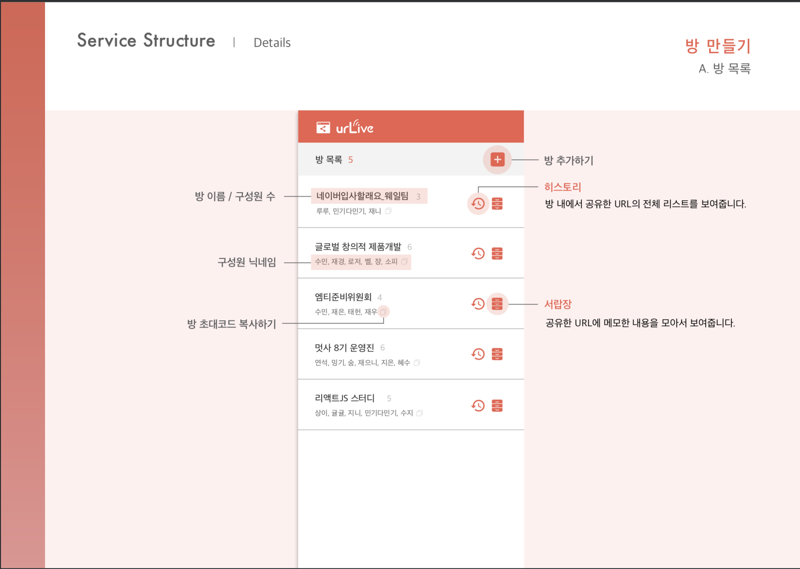
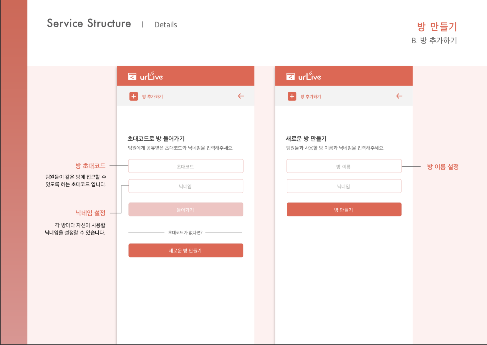
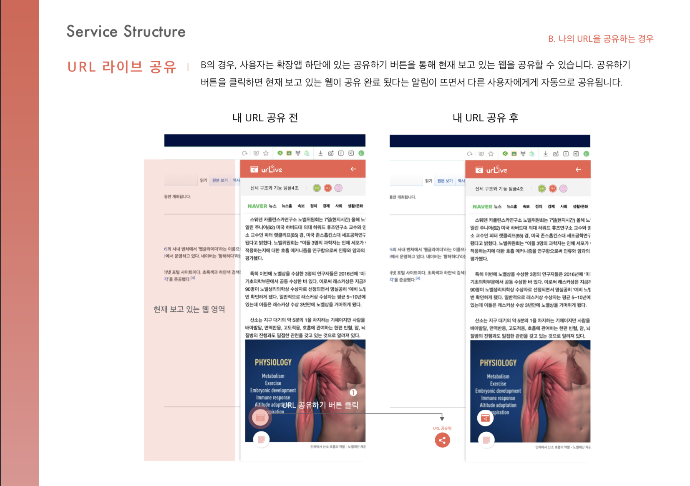
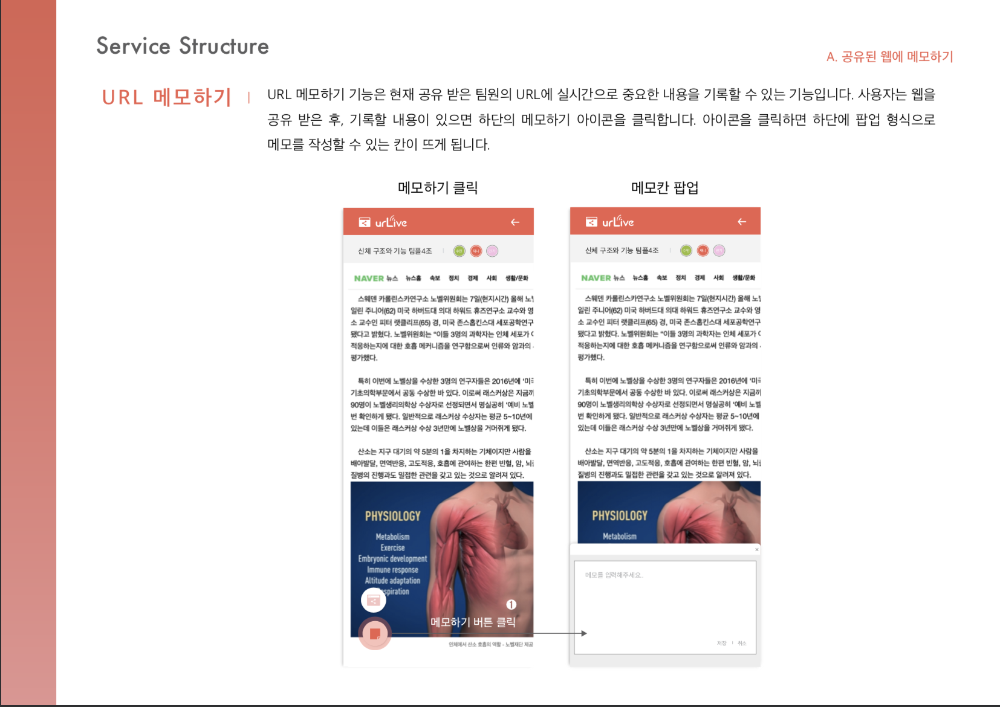
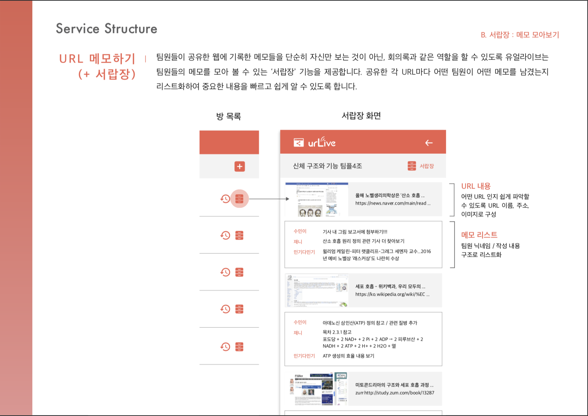

# urLive_extension
Front part of the Whale Extension 'UrLive', using Vanllia javscript 

## Winner of 3rd place for the Whale Extension Contest 2019

### Link to the extension: <https://store.whale.naver.com/detail/ggjohpipgoocjmnkpleikjkljlimillm>

#### Contributors: Lee Jaeeun, Kim Mingi, Lee Sumin (Seoul National University) 

